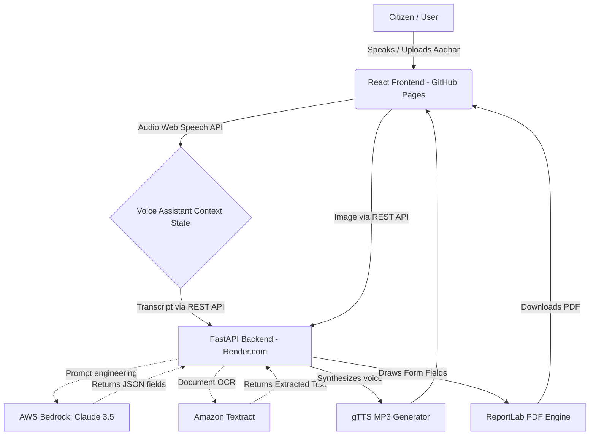

# Jan-Sahayak: Voice-First Governance for Bharat 🇮🇳


*An AI-powered multilingual assistant designed to bridge the digital divide in rural India by making government schemes accessible through natural conversation.*

**Live Prototype:** [https://smit6777.github.io/jan__sahayak/](https://smit6777.github.io/jan__sahayak/)

---

## 🚀 The Problem Statement
Accessing government assistance in rural India remains a massive challenge due to **complex bureaucracy, language barriers, and low digital literacy**. Typical online forms require users to read formal language, type precisely, and navigate confusing dropdowns. This forces citizens, particularly farmers, widows, and the elderly, to rely on costly middlemen to file baseline paperwork.

## 💡 Our Solution
**Jan-Sahayak** acts as a virtual government worker. Rather than forcing the user to learn how to click through a form, citizens simply speak to our AI in their native language (Hindi, Gujarati, English).

### Key Features
1. **Intelligent Triage:** If a user says "My crops failed", the AI analyzes the intent and recommends the ideal scheme (e.g., *PM Kisan Scheme*).
2. **Conversational Form Filling:** The AI verbally asks for details one-by-one (Name, Aadhar, Bank Info). It handles tangents gracefully.
3. **Smart Prompt Extraction (AWS Bedrock):** Our backend uses **Claude 3.5 Sonnet on AWS Bedrock** to extract structured JSON data perfectly from unstructured voice transcripts.
4. **Document OCR (AWS Textract):** Users can upload an image of their Aadhar card. Our backend sends it to **Amazon Textract** to auto-fill the digital form via OCR.
5. **PDF Generation:** Once the AI has gathered the data, it programmatically generates a beautifully filled PDF application (with localized Hindi/English headers) ready for official submission.

---

## 🛠️ Tech Stack & Architecture

Jan-Sahayak follows a scalable, microservices client-server architecture deployed on the cloud.



### Components
*   **Frontend**: React 19 + Vite, Framer Motion (for the interactive 3D listening orb), Web Speech API. Hosted on **GitHub Pages**.
*   **Backend API**: Python FastAPI, deployed live on **Render.com**.
*   **AI Engine**: AWS Bedrock (Claude 3.5 Sonnet) for reliable Hindi NLP extraction.
*   **OCR Engine**: Amazon Textract (boto3) for Aadhar card parsing.
*   **Audio Output**: Server-side gTTS (Google Text-to-Speech) for localized Indian accents.

---

## ⚙️ Running Locally

### Prerequisites
*   Node.js (v18+)
*   Python (3.9+)
*   AWS Account with Bedrock & Textract access keys

### 1. Start the Backend (FastAPI)
```bash
cd backend
python -m venv venv
source venv/bin/activate  # On Windows use `venv\Scripts\activate`
pip install -r requirements.txt

# Create a .env file
# Add your AWS keys to enable real AI extraction
cp .env.example .env
# Edit .env and set DEMO_MODE=false to use AWS Bedrock

# Run the server on http://localhost:8000
python main.py
```

### 2. Start the Frontend (React)
```bash
# From the root directory
npm install
npm run dev
# App will run on http://localhost:5173
```

---
**Built for the Hack2skill AI for Bharat Hackathon 2026 - Prototype Phase**
